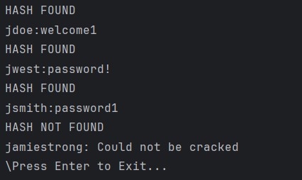

# CrackThatPassword
CrackThatPassword is a simple Python program that can be used to..crack passwords (quite obvious).
### 

## How does it work?
If someone were to hack a database that stores log-in information, that person would be able to see the usernames of several users and their hashes. These hashes are generated from hashing algorithms, which take plain text passwords (something like 'password!') and scrambles them, making the information harder to steal. People have obviously found ways around this, figuring out how to turn the hashes back into plain text. This is exactly what this python program does! It reads a list of usernames and their hashes ('username_hashes.txt), turns a bunch of common passwords into hashes ('common_passwords.txt'), and checks to see if any of the hashes from the common passwords list matches up with any hashes in the list of usernames and hashes.
